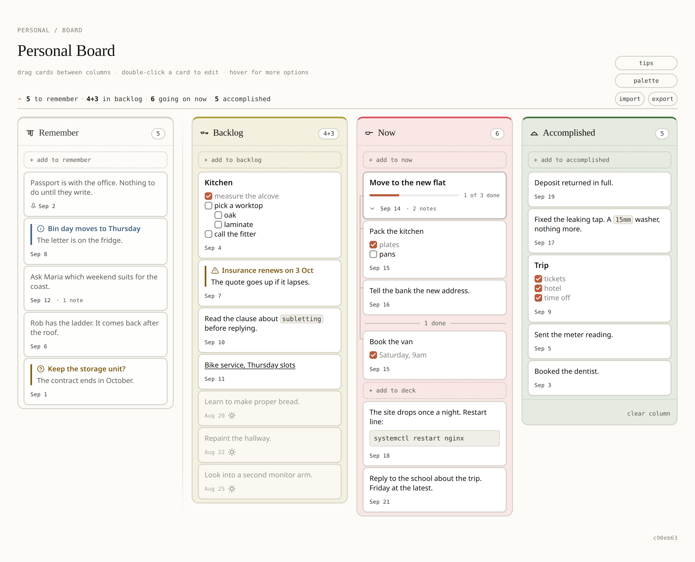

# Personal board

A personal board with four columns: Waiting for, Backlog, Now, Accomplished. The
board is one HTML file. There is no build step, no dependency and no server. Open
`index.html` in a browser and the board works.

**Waiting for** holds the cards that are blocked on someone else. A hairline
separates this column from the other three. The column stays uncoloured for every
palette. It uses the page background, with white cards and grey text.

## Use

Open `index.html` directly. A `file://` address works.

- **+ add** at the bottom of a column writes a new card. Enter saves the card.
  Shift+Enter makes a new line. Escape cancels.
- **Click a card** to edit the text of the card. The same keys apply.
- **≡** on a card opens the list. The list holds **edit**, **notes**, **export
  this card** and **delete**. A note carries the same button, with **edit** and
  **delete note**. Escape or a click outside closes the list.
- **Backticks** mark inline code. `` `npm test` `` shows as a monospace chip. The
  card keeps the backticks, so you see them again when you edit the card. A chip
  must hold text and stay on one line. A single backtick therefore stays a
  backtick.
- **Links**: the board finds links in the text of a card. Two shapes work, a bare
  `https://…` and `[what it is](https://…)`. Use the second shape for an address
  that is too long to read on a card. It shows the words and keeps the address
  behind them. A `mailto:` address is also a link. Nothing else is a link. A
  `javascript:` address is not a link. An address inside backticks is code, not a
  link. The card keeps the text you typed, so you see it again when you edit the
  card. A link opens in a new tab. A click on a link follows the link and does
  not open the card for editing. When a link is all that a card says, use **edit**
  in the list to open the card.
- **notes** opens the notes of the card, in a small window in the middle of the
  page. Notes are cards themselves. They take the same editing, backticks, links,
  dates and dragging to reorder. They have a list of their own, with a delete and
  an Undo. The window takes the colour of the column that holds the card. A card
  with notes says so next to its date. Escape or a click outside closes the
  window.
- **Drag a card** to move it within a column or to another column.
- **delete** takes a card off the board. It first asks **delete card?** in the
  list. **yes** deletes the card. **no** shows the words of the list again.
  **delete note** asks **delete note?** in the same way. **clear column** empties
  Accomplished and also asks first. All three raise a toast with an **Undo**.
- **export this card** writes one card to a file, with its notes. Use the file to
  pass the card to someone else. Import adds the card to the board and does not
  change the other cards. The card goes to the column it was sent from. If this
  board has no such column, the card goes to Backlog. The card arrives as a new
  card. The same file imported twice therefore gives two cards.
- **Palette** swaps the colours of Backlog, Now and Accomplished. Pick a family,
  then a combination. The panel stays open while you try the combinations. A
  click outside or Escape closes the panel.
- **Export** downloads the whole board as JSON. **Import** reads back a board or
  a single card.

## Storage

The board keeps the notes of a card on the card, so a card is whole on its own.
Notes travel with Export and Import. A delete takes the notes of the card with
it. Undo brings the card and the notes back. A board saved before notes existed
opens with no notes.

Two shapes leave the board and come back. A whole board is `{"cols": ...}` and
replaces the board that is here. One card is `{"card": ..., "col": ...}` and
joins the board. Import reads the file and tells the two shapes apart by the
fields the file carries.

The board lives in `localStorage` under `personal.board.v1`. The palette lives
under `personal.palette.v1`. Both are per browser and per machine. Use Export to
move a board to another machine. Two tabs on the same board stay in sync.

The page also reads two older keys, `todo.board.v1` and `backlog.board.v1`. The
first load carries a board under an older key over to the new key, and drops the
old key. Older JSON exports still import.

## Palettes

The colour combinations come from Sanzo Wada's *A Dictionary of Color
Combinations*. The board groups the combinations into families by their lead
colour, and trims each combination to three colours. Backlog, Now and
Accomplished take one colour each. Waiting for takes no palette colour.
